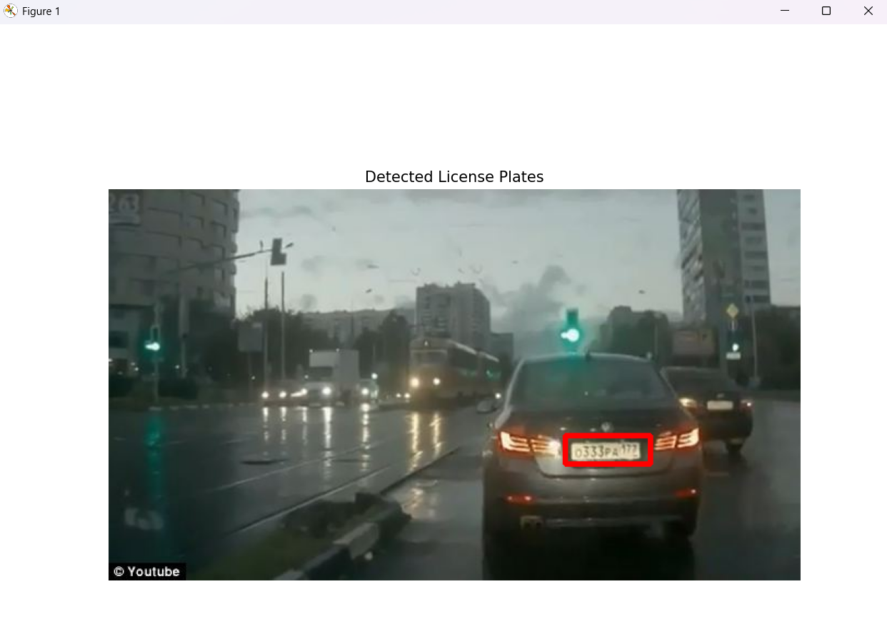
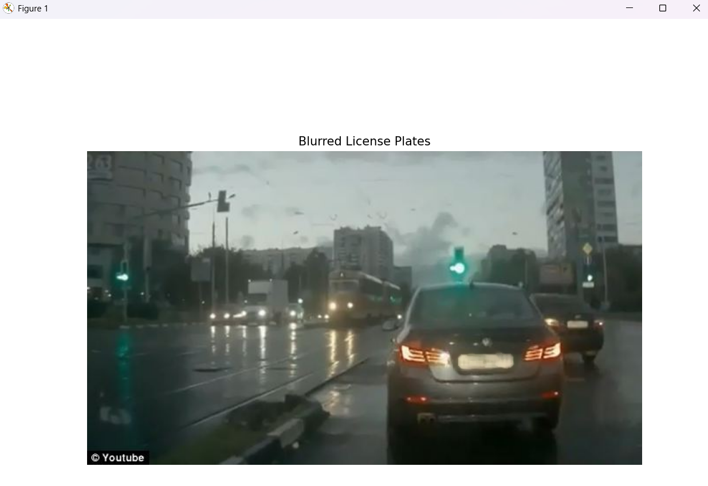

# License-Plate-Blurring
The project aims to detect license plates in images or video streams and blur them to anonymize sensitive information, ensuring privacy and compliance with data protection regulations.

 
 
<h1>SCREENSHOTS</h1>

